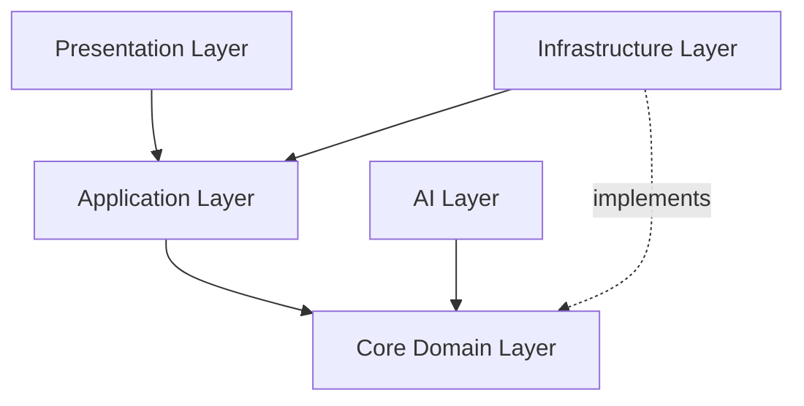

# GitNexus Knowledge Graph for Ekko

## Project Overview

**Name**: Ekko  
**Type**: AI-Powered Voice Assistant Platform  
**Architecture**: Clean Architecture  
**Stack**: Python 3.12 + FastAPI + React 19 + TypeScript

---

## 🏗️ Architecture Layers



### Core Domain (`backend/src/ekko/core/`)
**Purpose**: Business logic, domain entities, value objects  
**Dependencies**: NONE (framework-independent)  
**Contains**:
- `entities/` - Domain entities
- `value_objects/` - Immutable value objects
- `interfaces/` - Port protocols
- `enums/` - Domain enumerations
- `exceptions/` - Domain exceptions

**Rules**:
- NO imports from other layers
- NO framework dependencies
- Pure business logic only

### Application Layer (`backend/src/ekko/application/`)
**Purpose**: Use case orchestration  
**Dependencies**: Core, Config, Utils  
**Contains**:
- `services/` - Orchestration services
- `dtos/` - Data transfer objects
- `mappers/` - Entity ↔ DTO conversion
- `handlers/` - Application event handlers

**Rules**:
- Can import from Core
- CANNOT import from Infrastructure or Presentation

### Infrastructure Layer (`backend/src/ekko/infrastructure/`)
**Purpose**: External integrations, persistence  
**Dependencies**: Core, Config, Utils, External libs  
**Contains**:
- `db/` - SQLAlchemy models, repositories
- `adapters/` - External service adapters
- `concurrency/` - Thread/queue management
- `llm/` - LLM clients
- `stt/` - Speech-to-text

**Rules**:
- Implements protocols from Core
- CANNOT import from Application or Presentation

### AI Layer (`backend/src/ekko/ai/`)
**Purpose**: AI/ML pipeline  
**Dependencies**: Core, Config, Utils  
**Contains**:
- `crewai/` - Multi-agent system
- `chains/` - LangChain conversation chains
- `pii/` - PII anonymization
- `embeddings/` - Embedding service
- `prompts/` - Prompt templates

**Rules**:
- Can import from Core
- CANNOT import from Infrastructure or Presentation

### Presentation Layer (`backend/src/ekko/presentation/`)
**Purpose**: API endpoints, GraphQL  
**Dependencies**: Application, Core, Config, Utils  
**Contains**:
- `api/routes/` - FastAPI REST routes
- `graphql/` - Strawberry GraphQL schema
- `middleware/` - HTTP middleware

**Rules**:
- Top layer - can import from any layer
- Delegates to Application services

---

## 📦 Key Components

### Backend

#### FastAPI Application
- **Location**: `backend/src/ekko/presentation/api/`
- **Purpose**: REST API endpoints
- **Tech**: FastAPI, Uvicorn
- **Routes**:
  - `/api/v1/health` - Health check
  - `/api/v1/stream/audio` - Audio streaming
  - `/graphql` - GraphQL endpoint

#### GraphQL API
- **Location**: `backend/src/ekko/presentation/graphql/`
- **Purpose**: GraphQL queries/mutations/subscriptions
- **Tech**: Strawberry GraphQL
- **Features**:
  - Type-safe schema
  - Real-time subscriptions
  - WebSocket support

#### CrewAI Multi-Agent System
- **Location**: `backend/src/ekko/ai/crewai/`
- **Purpose**: AI agent orchestration
- **Tech**: CrewAI, LangChain
- **Config**: YAML-based in `config/`

#### Database
- **Location**: `backend/src/ekko/infrastructure/db/`
- **Purpose**: Data persistence
- **Tech**: SQLAlchemy 2.0+, SQLite, aiosqlite
- **Migrations**: Alembic

#### PII Anonymization
- **Location**: `backend/src/ekko/ai/pii/`
- **Purpose**: Scrub sensitive data before LLM calls
- **Tech**: Regex-based patterns

### Frontend

#### React Application
- **Location**: `frontend/src/`
- **Purpose**: User interface
- **Tech**: React 19, TypeScript, Vite 6
- **Features**:
  - shadcn/ui components
  - Tailwind CSS v4
  - Zustand state management
  - TanStack React Query

#### UI Components
- **Location**: `frontend/src/presentation/components/`
- **Purpose**: Reusable UI components
- **Tech**: shadcn/ui, Radix, Tailwind
- **Testing**: Storybook

---

## 🔗 Key Relationships

### Dependency Injection
```
Container (composition/)
  ├─> Settings (config/)
  ├─> Database Engine (infrastructure/db/)
  ├─> Repositories (infrastructure/db/repositories/)
  ├─> Services (application/services/)
  ├─> LLM Clients (infrastructure/llm/)
  └─> FastAPI App (presentation/api/)
```

### Data Flow
```
User Request
  ↓
FastAPI Route (presentation/)
  ↓
Application Service (application/)
  ↓
Domain Entity (core/)
  ↓
Repository Protocol (core/interfaces/)
  ↓
Repository Implementation (infrastructure/)
  ↓
Database (SQLAlchemy)
```

---

## 🧪 Testing Strategy

### Test Types
- **Unit**: `backend/tests/unit/` - Fast, isolated, no I/O
- **Integration**: `backend/tests/integration/` - DB, API, external services
- **Property**: `backend/tests/property/` - Hypothesis tests
- **E2E**: `backend/tests/e2e/` + `frontend/` - Full user flows
- **Performance**: `backend/tests/performance/` - Benchmarks

### Test Tools
- **Backend**: pytest, hypothesis, factory-boy, pytest-asyncio
- **Frontend**: Vitest, React Testing Library, fast-check, Playwright

### Coverage Target
- **Minimum**: 70%
- **Goal**: 80%+
- **Critical paths**: 100%

---

## 🛠️ Development Tools

### Code Quality
- **Python Linting**: ruff (`backend/ruff.toml`)
- **Python Formatting**: ruff format
- **Python Type Checking**: mypy
- **Frontend Linting**: Biome
- **Frontend Type Checking**: TypeScript

### Security
- **Secret Detection**: detect-secrets
- **Security Linting**: bandit
- **Vulnerability Scanning**: pip-audit
- **Pre-commit Hooks**: `.pre-commit-config.yaml`

### AI Assistance
- **GitHub Copilot**: Claude 3.5 Sonnet via model selection
- **Custom Agents**:
  - Backend Python Developer
  - Frontend React Developer
  - Testing Specialist
  - Database Specialist
  - Security Specialist
- **CodeRabbit**: AI code review

### Terminal
- **Warp**: Modern terminal with 20+ workflows
- **Task**: Task runner (Taskfile.yml)

---

## 📋 Common Workflows

### Adding New Feature
1. Define domain entity in `core/entities/`
2. Create DTO in `application/dtos/`
3. Create mapper in `application/mappers/`
4. Implement service in `application/services/`
5. Add repository protocol in `core/interfaces/`
6. Implement repository in `infrastructure/db/repositories/`
7. Add route in `presentation/api/routes/`
8. Write tests
9. Create migration if needed

### Database Changes
1. Modify model in `infrastructure/db/models/`
2. Generate migration: `alembic revision --autogenerate`
3. Review and edit migration
4. Apply: `alembic upgrade head`
5. Update repository if needed
6. Write tests

### Frontend Component
1. Create component in `presentation/components/`
2. Add types in `domain/models/types/`
3. Add Zod schema in `domain/models/schemas/`
4. Add Storybook story
5. Write tests with React Testing Library
6. Use in page/feature

---

## 🎯 Key Patterns

### Repository Pattern
```python
# Protocol in core/
class UserRepository(Protocol):
    async def get_by_id(self, id: str) -> User | None: ...

# Implementation in infrastructure/
class SQLAlchemyUserRepository:
    async def get_by_id(self, id: str) -> User | None:
        # SQLAlchemy implementation
```

### Service Pattern
```python
# Application service
class UserService:
    def __init__(self, repo: UserRepository) -> None:
        self._repo = repo

    async def get_user(self, id: str) -> UserDTO:
        entity = await self._repo.get_by_id(id)
        return UserMapper.to_dto(entity)
```

### DI Container
```python
from dataclasses import dataclass
from functools import cached_property

@dataclass
class Container:
    @cached_property
    def settings(self) -> Settings:
        return get_settings()

    @cached_property
    def user_repository(self) -> UserRepository:
        return SQLAlchemyUserRepository(self.db_session)

    @cached_property
    def user_service(self) -> UserService:
        return UserService(self.user_repository)
```

---

## 🔧 Configuration

### Environment
- **Local**: `.env.local`
- **Test**: `.env.test`
- **EKKO_ENVIRONMENT**: Controls settings factory

### Settings
- **Base**: `backend/src/ekko/config/settings/base.py`
- **Local**: `backend/src/ekko/config/settings/local.py`
- **Test**: `backend/src/ekko/config/settings/test.py`

### Database
- **Driver**: aiosqlite (async SQLite)
- **File**: `backend/ekko.db`
- **Migrations**: `backend/alembic/versions/`

---

## 📚 Documentation

### User Docs
- `README.md` - Project overview
- `docs/TOOLS_SETUP_GUIDE.md` - Complete setup
- `docs/CLAUDE_COPILOT_GUIDE.md` - AI coding guide

### Developer Docs
- `AGENTS.md` - Agent instructions
- `.github/copilot-instructions.md` - Copilot instructions
- `.github/agents/` - Custom agents
- `.github/skills/` - Skill packs

### API Docs
- Swagger UI: `http://localhost:8000/docs`
- ReDoc: `http://localhost:8000/redoc`
- GraphQL: `http://localhost:8000/graphql`

---

## 🚀 Deployment

### Build
```bash
task build:exe  # Windows EXE via PyInstaller
```

### Docker
```bash
docker compose up  # DevContainer
```

### Local
```bash
task dev  # Start backend + frontend
```

---

## 🎓 Learning Resources

### Architecture
- Clean Architecture book by Robert C. Martin
- Hexagonal Architecture
- Domain-Driven Design

### Technologies
- FastAPI: https://fastapi.tiangolo.com/
- SQLAlchemy: https://docs.sqlalchemy.org/
- React: https://react.dev/
- Strawberry GraphQL: https://strawberry.rocks/

---

This knowledge graph serves as the comprehensive reference for GitHub Copilot and other AI assistants to understand the Ekko project structure, patterns, and workflows.
